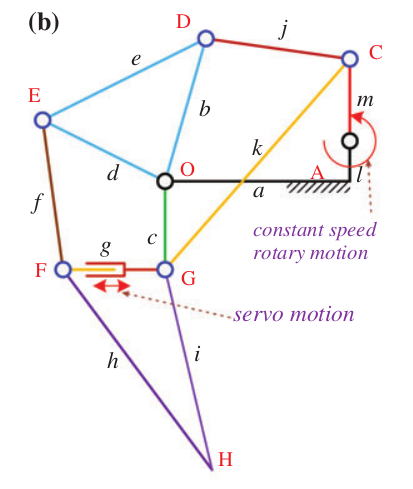

# List of My Projects

| Travelling Salesman Problem  | Closed-chain-legged robot with Hybrid-driven Mechanism | Optimizing link lengths of Theo-Jensen's Mechanism |PANACEA|
| ------------- | ------------- | ------------- | ------------- |
| |   |   | |

| Bone Conducting Headphone  | Paper 3D LOM | Path Planning Kuka Bot | Bezier Curves |
| ------------- | ------------- | ------------- | ------------- |
| |   |   | |

| Metal Additive Manufacturing  | Force Controlled Compliant Gripper | Titanium NanoTubes | Student Designed Experiment |
| ------------- | ------------- | ------------- | ------------- |
| |   |   | |

- [ ] [Mathematical Modelling of Motors]()
- [ ] [Disassembly Project](https://docs.google.com/presentation/d/1x9--k5ceChA7rfNUJ0Ouza83KQWaTfdecITDHePwBLI/edit#slide=id.g452cec4887_2_1)

## Competitions

- [ ] IROS 2021
- [ ] Bajaj Mach Challenge 2020
- [ ] Robocon 2019
- [ ] Swachh Maharastra Grand Challenge 2019
- [ ] Line Follower Bot 2018
